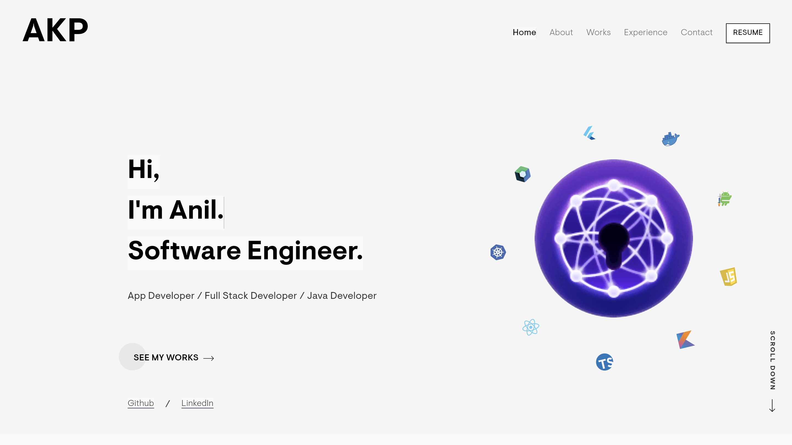
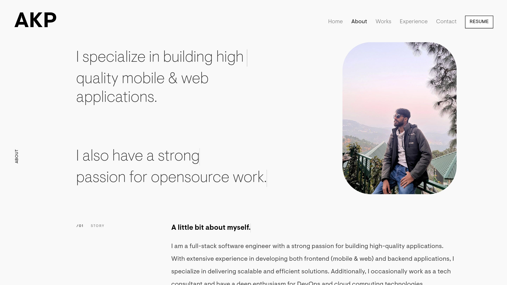
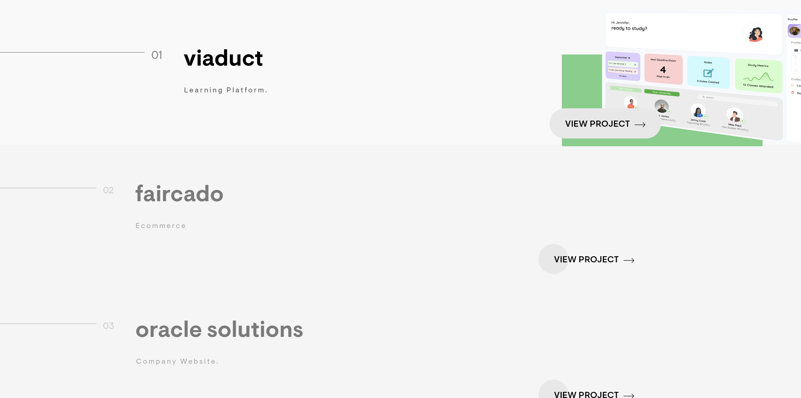

# 🖥️ Anil Kumar's Portfolio
Welcome to the repository for my **personal portfolio website**! This portfolio showcases my skills, projects, and professional journey as a developer. It's built to give visitors an insight into my work and expertise.

**🔗 [Visit my live portfolio here!](https://anilkumar05.netlify.app/)**

---

## 🚀 Tech Stack Used
- **Frontend:** Flutter, Android Development, and dart.
- **Version Control:** Git, GitHub

---

## 🖼️ Preview of My Portfolio

Here are a few screenshots of my live portfolio:

  
  


---

## 📚 What You Can Find in This Portfolio
- **About Me:** A brief introduction and background.
- **Projects:** Showcase of my key projects, including descriptions and technologies used.
- **Skills:** A detailed list of my technical skills and proficiencies.
- **Contact Section:** Links to my professional profiles and how to get in touch.

---

## 🛠️ Installation and Setup Instructions
If you'd like to run this portfolio locally, follow these steps:

1. **Clone the Repository:**
   ```bash  
   git clone https://github.com/Akp0516/my_portfolio.git 
   
2.**Navigate to the Project Directory:**
    
    cd <project_folder> 

3.**Install the Flutter Dependencies:**

    flutter pub get 

4.**Run the App app on the web:**

    flutter run -d chrome  


